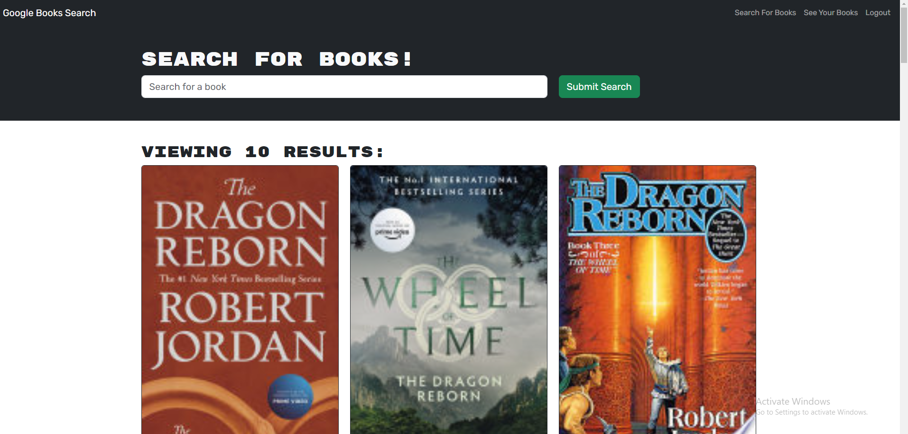

# book-search-engine

A Google Books API search engine built with React.

## Description

In this project, I was presented with starter code for a book searching app. It is using both Apollo, React, and a MongoDB database
- Search for books, create a profile; add or remove books from your profile. 
- This application is built with Apollo Server and React. It uses a MongoDB database and Node.js/Espress.js server and API. It is a full-stack MERN application. 
- The application uses GraphQL queries and mutations to fetch and modify data, and allows the user to find, save and delete book queries, as well as login with a user profile and password. 
- The developer learned how to refactor an existing RESTful API, implement mongoDB and Apollo Server, set up user models, authentication methods for security, call on local storage, deploy a React front end, and handle server errors. Server error handling was extremely important on this project because it allowed the developer to follow the code and to identify specific areas that needed debugging.

## Table Of Contents

[Installation](#installation)

[Usage](#usage)

[Credits](#credits)

[License](#license)

## Installation

Visit the Heroku deployed app [here]()

GitHub URL: https://github.com/spzweifel/book-search-engine

## Usage

Deployed application url:

## Screenshot / Video

## Contributing

Third party assets used in this project include:
Mongo DB: https://www.mongodb.com/

## License

This project is licensed under the MIT license.

## Features

- MongoDb 
- GraphQL API 
- React 
- Apollo Server 
- Node.js

